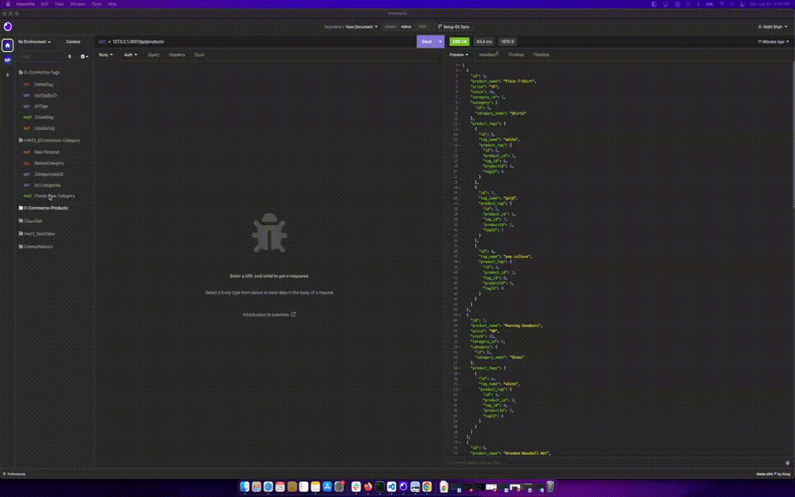

<h1 align="center">E-Commerce DB CURD Operations with Models</h1>
   
## Description
  
🔍 This application demonstrates the CRUD operations using sequalize models.

1. [GitHub Repo E-Commerce URL](https://github.com/shahnidhi20/HW13_E-Commerce/)

## Output Screenshot

1. Below screenshot demonstrates the Seed data being added in the database
   The video file can be found: [here](./output/DB_Seed.webm)

   

2. Below Screenshot demonstrates the GET, POST, PUT and Delete operatiosn for Model Category
   The video file can be found: [here](./output/CRUD_Category.webm)

   

3. Below Screenshot demonstrates the GET, POST, PUT and Delete operatiosn for Model Product
   The video file can be found: [here](./output/CRUD_Products.webm)

   

4. Below Screenshot demonstrates the GET, POST, PUT and Delete operatiosn for Model Tags
   The video file can be found: [here](./output/CRUD_TAGS.webm)

   

## User Story

```
AS A manager at an internet retail company
I WANT a back end for my e-commerce website that uses the latest technologies
SO THAT my company can compete with other e-commerce companies
```

## Acceptance Criteria

```
GIVEN a functional Express.js API
WHEN I add my database name, MySQL username, and MySQL password to an environment variable file
THEN I am able to connect to a database using Sequelize
WHEN I enter schema and seed commands
THEN a development database is created and is seeded with test data
WHEN I enter the command to invoke the application
THEN my server is started and the Sequelize models are synced to the MySQL database
WHEN I open API GET routes in Insomnia Core for categories, products, or tags
THEN the data for each of these routes is displayed in a formatted JSON
WHEN I test API POST, PUT, and DELETE routes in Insomnia Core
THEN I am able to successfully create, update, and delete data in my database
```

## Table of Contents

- [Description](#description)
- [Output Screenshot](#output-screenshot)
- [User Story](#user-story)
- [Acceptance Criteria](#acceptance-criteria)
- [Table of Contents](#table-of-contents)
- [Installation](#installation)
- [Usage](#usage)
- [Contributing](#contributing)

## Installation

`npm i`

## Usage

Run the following command at th root of your project and answer the prompted questions:
`npm run seed`
`npm start`

## Contributing

- [Nidhi Shah](https://github.com/shahnidhi20/)
